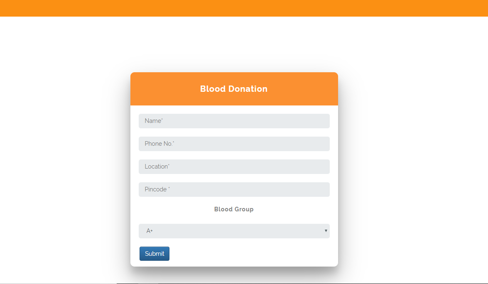
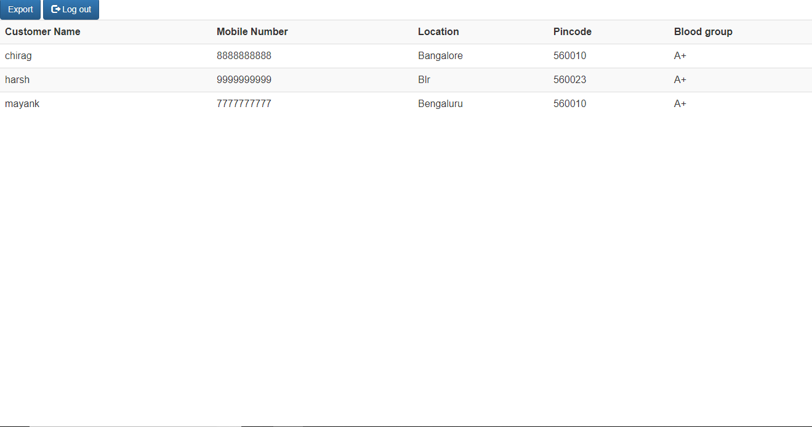
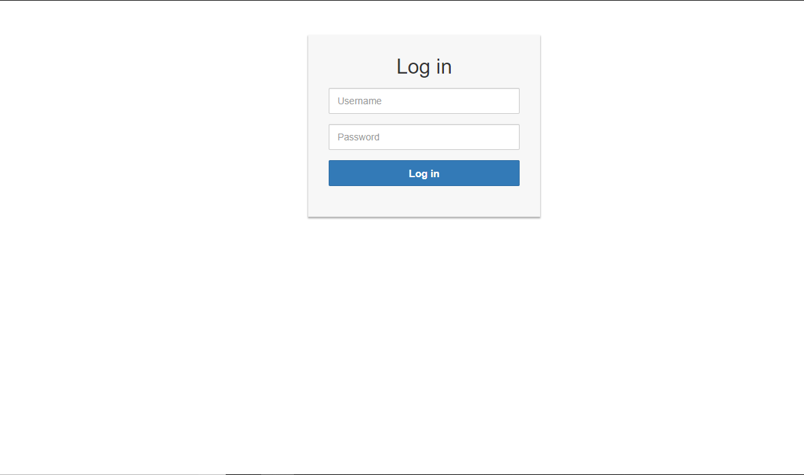
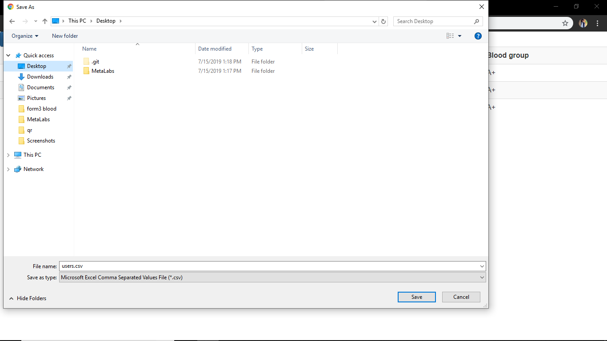
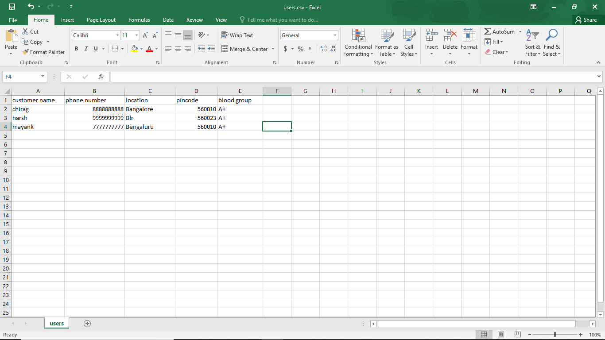

# Form-export-phpmyadmin
An authentication based system to Download/Export data from PhpMyAdmin without logging in into the C-Panel 

## Features 

- Form built using Bootstrap, PHP and MySQLi
- Secure Admin login.
- Viewing the database entries in tablular format.
- Exporting Contents of PhpMyAddmin in .csv format via Export button.
- Auto-creation of column names as given on PhpMyAdmin.

## Screenshots

| Form | Index Page | Admin Login |
| -------|--------------|-----------------|
|  |  |  |

| Download | CSV Format | 
| ---------------|------------------|
|  |  | 

